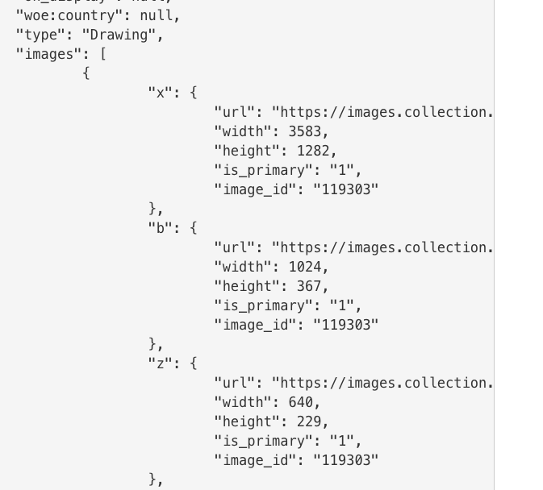

# Muse: An Inspiration Board  
## Android Weekly Project 

#### By Jessica Sheridan 

## Description

The 'Muse' app is an inspiration board fueled by the Cooper Hewitt Museum API. Cooper
Hewitt, is a design museum located in NYC's Upper East Side. It is the only
museum in the US devoted to historical and contemporary design. It's collection
and exhibitions explore approximately 240 years of design aesthetic and creativity
and is amazing fodder for designers and enthusiasts alike to browse and seek inspiration
from their evolving collections and have their images and historical context at their
fingertips to spark their next project or daydream.

## Design MVP
* Muse will provide a palette of colors for the user to select and browse through museum offerings
and save them to a board.
* A "random" feature will also be implemented to select a random Museum Object for user exploration.
* Additional search /museum navigation can be included as project evolves.

## Design Notes:
The user interface will be clean and simple to highlight the visual content. 
The Cooper Hewitt typeface is implemented for a cohesive experience with the museum, in addition
to a light mid-century modern typeface to accentuate the design. 

## Week 1 User Stories: 
* Researched API Data to prepare app high level design.

|Function  | Activity | Description | Status |
| ------------- | ------------- | ----------------- | ------------|
|Main | MainActivity | 3x3 grid of images for navigation | incomplete | 
|About | AboutActivity | app background | to do| 
|Cooper Hewitt | MuseumActivity | museum background | need text, You can click CooperHewitt (this will move into 3x3 grid)|
|Color Query | ColorsActivity | palette of colors to explore offerings| functionality started, click on color swatch  |
|Museum Objects Result | ObjectsActivity | result of color query | week 2 API |
|Museum Object Detail | ObjectDetailActivity | Museum Object Selection with option to save to board | week 2 API |
|Random Museum Object | ObjectDetailActivity | random Museum ID passed (with option to save to board)| week 2 API |
|Muse Boards Index | BoardIndexActivity | will include Dialog Fragment for User Input to Create New Board |  |
|Muse Board | BoardActivity | will  include museum objects for specified board  |  |

## Questions 
* Currently determining how many colors makes sense to provide to the user for query.
* Look into Buffer message that appears when a color swatch is clicked.

## API Data Example:

## Setup/Installation:
* Clone the repo
* Open in Android Studio with Virtual Android Device, run app 

## Technologies Used
Android Studio, Postman, Cooper Hewitt API, Java

### Legal

