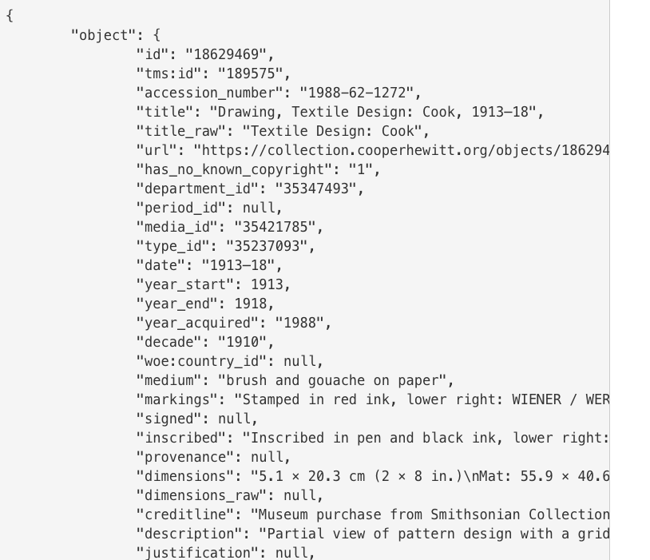
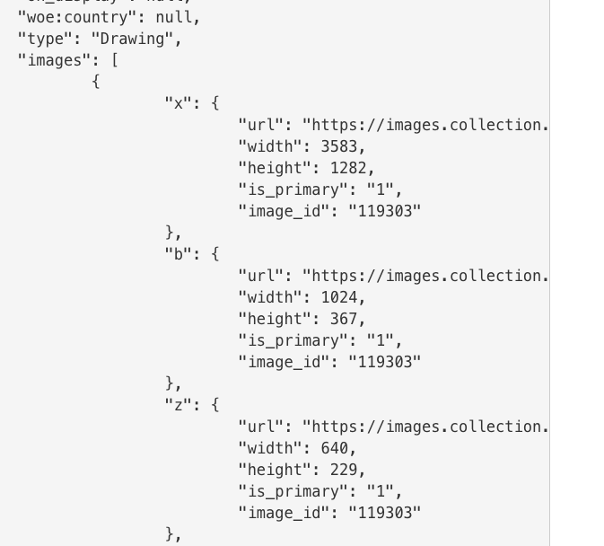

# Muse: An Inspiration Board  
## Android Weekly Project 

#### By Jessica Sheridan 

## Description

The 'Muse' app is an inspiration board fueled by the Cooper Hewitt Museum API. Cooper
Hewitt, is a design museum located in NYC's Upper East Side. It is the only
museum in the US devoted to historical and contemporary design. It's collection
and exhibitions explore approximately 240 years of design aesthetic and creativity
and is amazing fodder for designers and enthusiasts alike to browse and seek inspiration
from their evolving collections and have their images and historical context at their
fingertips to spark their next project or daydream.

## Design MVP
* Muse will provide a palette of colors for the user to select and browse through museum offerings
and save them to a collection.
* A "random" feature will also be implemented to select a random Museum Object for user exploration.
* Additional search /museum navigation can be included as project evolves.

## Design Notes:
The user interface will be clean and simple to highlight the visual content. 
The Cooper Hewitt typeface is implemented for a cohesive experience with the museum, in addition
to a light mid-century modern typeface to accentuate the design. 

## Week 1 User Stories: 
* Researched API Data to prepare app high level design.

updated 10/20/2017

|Function  | Activity | Description | Status |
| ------------- | ------------- | ----------------- | ------------|
|Main | MainActivity | 3x3 grid of images for navigation | to do |
|About | AboutActivity | app background | write text |
|Color Query | ColorListActivity | palette of colors to query Museum collection| completed|
|Museum Objects Result | ArtifactListActivity | result of color query | completed |
|Museum Object Detail | ArtifactDetailActivity | Museum Object Selection with details| completed|
|Muse Collections | CollectionIndexActivity | will include Dialog Fragment for User Input to Create New Board | week3 Persisting Data  |
|Muse Collection | CollectionDetailActivity | will  include museum objects for specified collection  |  week3 |
|Museum Object Detail | ArtifactDetailActivity | add option to save to Collection| week3|

## Week2 Highlights
 * Moved color Grid into RecyclerView
 * CSS3_PALETTE in Constants
 * Created Fragment for details of museum object with FragmentPagerAdapter
 * Implicit Intent for all museum objects to view in the CooperHewitt website

## Week3 Highlights
 * Firebase user authentication implemented.
 * Included a user Gallery to save Museum Objects by username in Firebase
 * Firebase-Recycler Adapter is used to display from the database
 * Option added for user to search museum using a 'word' in addition
 	to the color swatch search using searchview widget.
 * SharedPreferences is used to save the last 'word' query 
 * Added a bottomNavigationView in the Main Acitivity that will be extended in
	additional areas (specifically the detail page).

## Problems to Address/Things to do:
* Clean up the detail View layout. When there is lengthy background material, it is still getting cut
    off at the bottom even in the scrollable view. Include the bottomNavView here.
* Add additional code for correctly processing the "random" feature. 
* Style the CreateAccountActivity, UserAccountActivity to be cohesive with LoginActivity.
* Improve the ArtifactList layout so image can occupy for width.
* Write the "About" text.

## API Data Example:

## Setup/Installation:
* Clone the repo
* Open in Android Studio with Virtual Android Device, run app 

## Technologies Used
Android Studio, Postman, Cooper Hewitt API, Java

### Legal

